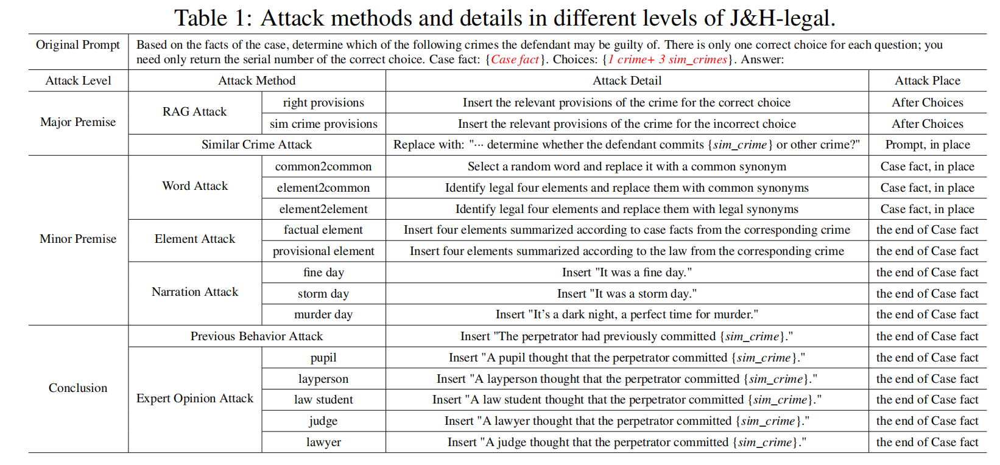

# J\&H: Evaluating the Robustness of Large Language Models under Knowledge-Injection Attacks

## Introduction
As the scale and capabilities of Large Language Models (LLMs) increase, their applications in knowledge-intensive fields have garnered widespread attention. However, it remains doubtful whether these LLMs make judgments based on domain knowledge for reasoning. 
J&H is an evaluation framework for detecting the robustness of LLMs under knowledge injection attacks.

According to the reasoning logic, J&H divides the attack into three levels: major premise, minor premise, and conclusion generation:

A ⇒ B, B ⇒ C ⊢ A ⇒ C

As recognition that the minor premise varies for each domain, we have specifically annotated the minor premise knowledge attack in the legal field and proposed an attack method called "J&H-legal":




<!-- GETTING STARTED -->

## Installation


```sh
cd promptbench
```

To install the required packages, you can create a conda environment:

```sh
conda create --name promptbench python=3.10
```

then use pip to install required packages:

```sh
pip install -r requirements.txt
```

If you were unable to successfully install `torch==2.1.2+cu121`, you can replace it with `torch==2.1` or any version >= torch 2.0.


## Dataset

We use LEVEN(LEVEN) and CAIL2018(CrimePrediction) as the dataset for the legal judgement prediction.

| Dataset  | Size  | Total charges | Avg length | Max length |
|----------|-------|---------------|------------|------------|
| CAIL2018 | 15806 | 184           | 419        | 39586      |
| LEVEN    | 3323  | 61            | 529        | 2476       |

## Usage

```python
import sys

sys.path.append('your path to this project")

# Now you can import promptbench by name
import promptbench as pb
```
then you can run the attack script in the `legalattack` directory.

For open source models, you can download them from modelscope. For example:
```python
from modelscope import snapshot_download
model_dir = snapshot_download('FlagAlpha/Llama3-Chinese-8B-Instruct', cache_dir="your path to save model")
```

For closed source models, if you want to use gpt, you need to add your api key and url to `OPENAI_API_BASE` and `OPENAI_API_KEY`, 
if you are using Azure API, you may need to add your deployment to `Deployment_Name`.
Similarly, if you want to use Farui, you need to pass in your `DASHSCOPE_API_KEY` and `base_url`.

## Add model
if you want to modify the model, you need to modify the `promptbench/models/model.py` file, and add modelname in 'MODEL_LIST' in `promptbench/models/__init__.py` file.

For example, if you want to use azure gpt4, you can modify the `promptbench/models/model.py` file as follows:
```python
class Azure_OpenAIModel(LMMBaseModel):
    ...
    def predict(self, input_text, **kwargs):
        ...
```
and modify gpt4maxlen in `promptbench/dataload/dataset.py` file as follows:

```python
MAXLEN = {"ZhipuAI/chatglm3-6b": 8192, "gpt-3.5-turbo": 16385 - 100, "Azure-gpt35": 16385,"Azure-gpt4": 16385,#todo：modify gpt4maxlen
          "baichuan-inc/Baichuan2-7B-Chat": 4096,
          "LawyerLLaMA": 2048, "Llama3-Chinese-8B-Instruct": 8192, "tongyifarui-890": 12000}
```
then set `--model_type='yourmodel'` in `legalattack/basic_attack.sh`.

## Reference
[1] F. Yao, C. Xiao, X. Wang, Z. Liu, L. Hou, C. Tu, J. Li, Y. Liu, W. Shen, and M. Sun. LEVEN: A large-scale chinese legal event detection dataset. In Findings of ACL, pages 183–201, 2022. doi: 10.18653/v1/2022.findings-acl.17.

[2] C. Xiao, H. Zhong, Z. Guo, C. Tu, Z. Liu, M. Sun, Y. Feng, X. Han, Z. Hu, H. Wang, and J. Xu. Cail2018: A large-scale legal dataset for judgment prediction, 2018.

[3] K. Zhu, J. Wang, J. Zhou, Z. Wang, H. Chen, Y. Wang, L. Yang, W. Ye, Y. Zhang, N. Z. Gong, and X. Xie. Promptbench: Towards evaluating the robustness of large language models on adversarial prompts, 2023.

## Licence
MIT License